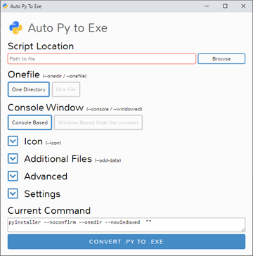

Combined Pix2Pix (Conditional GAN) and TecoGAN (TEmporally COherent GAN) super resolution Networks.

### Step 1. Clone repository
```
git clone https://github.com/bigalex95/pix2pix_TecoGAN
```
### Step 2. Create virtualenv and install necessary libraries.
```
# create virtualenv
python -m venv venv_name
# change environment to virtualenv
## Windows 
### 1. cmd.exe
./venv_name\Scripts\activate
### 2. PowerShell
./venv_name/Scripts/activate.ps1
## Linux bash
./venv_name/bin/activate
# install packages
pip install -r requirements.txt
```

## Usage

### Step 1. Run jupyter notebook.
```
jupyter notebook
```
You should see the notebook open in your browser.
### Step 2. Open scripts in [pix2pix](./pix2pix) folder and train pix2pix model.

### Step 3. Open scripts in [TecoGAN_PyTorch](./TecoGAN_PyTorch) fodler and train tecogan model or download pretrained models.

### Step 4. Open scripts in [TF_to_TF-TRT](./TF_to_TF-TRT) folder convert pix2pix checkpoint model to saved_model.

### Step 5. Open [pix2pix_tecogan.ipynb](pix2pix_tecogan.ipynb) script, configure necessary arguments and run the script.

## Compile to execution file
### Step 1. Use auto-py-to-exe library for compiling.
```
# Windows
auto-py-to-exe.exe
# Linux
auto-py-to-exe
```
This command open auto-py-to-exe GUI like below.

